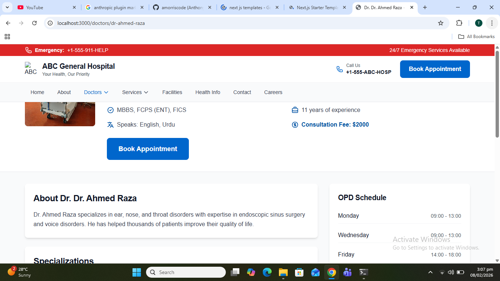
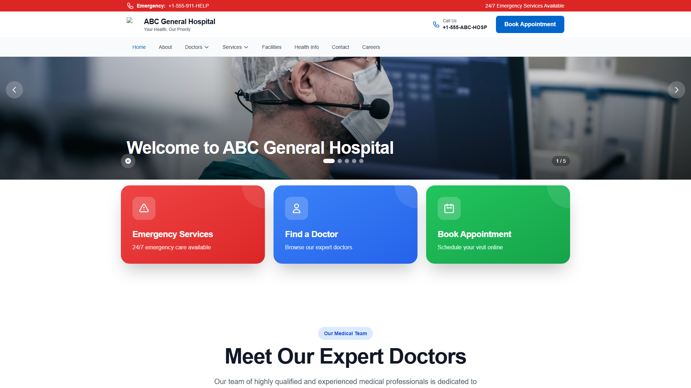
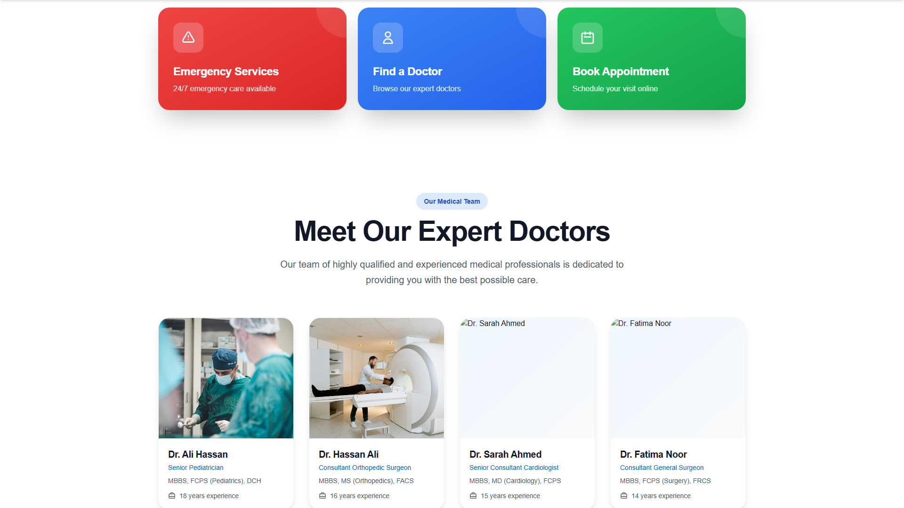
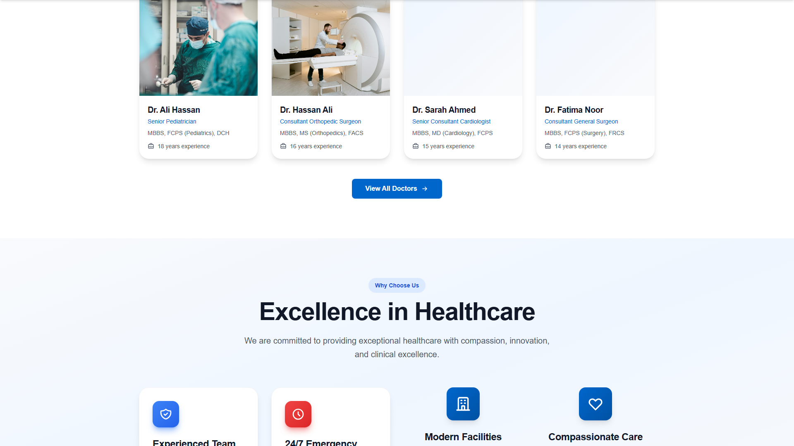
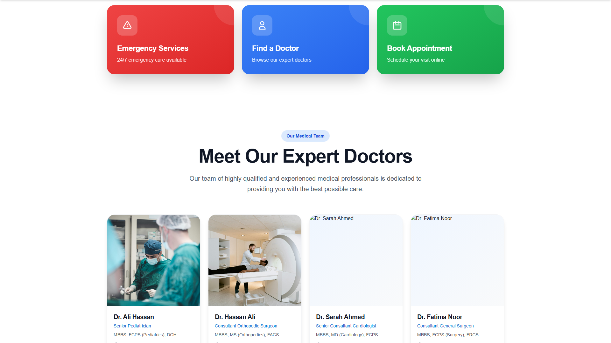
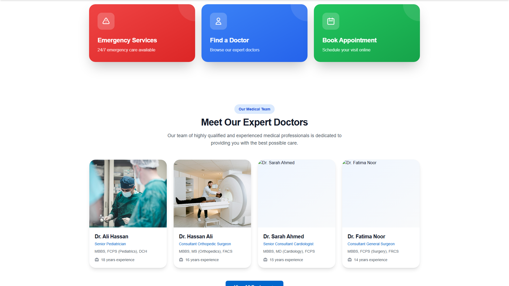
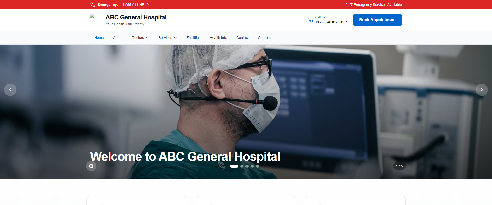
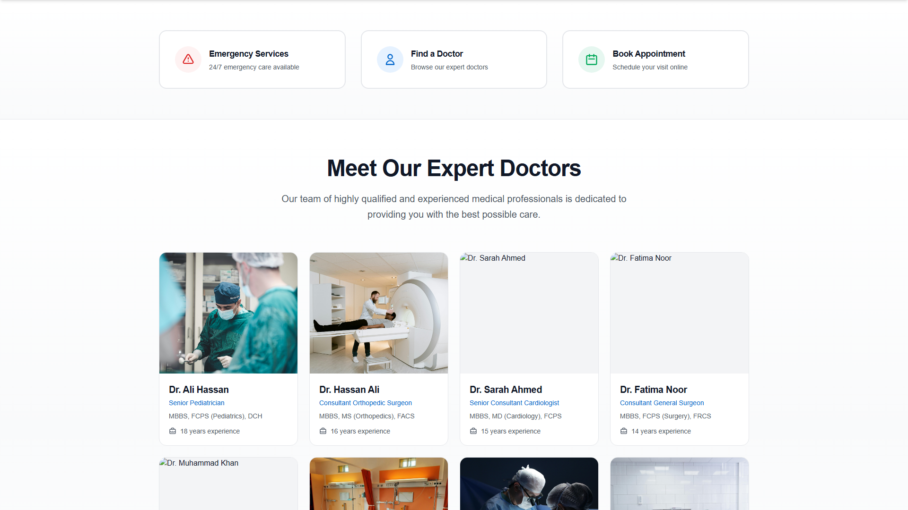
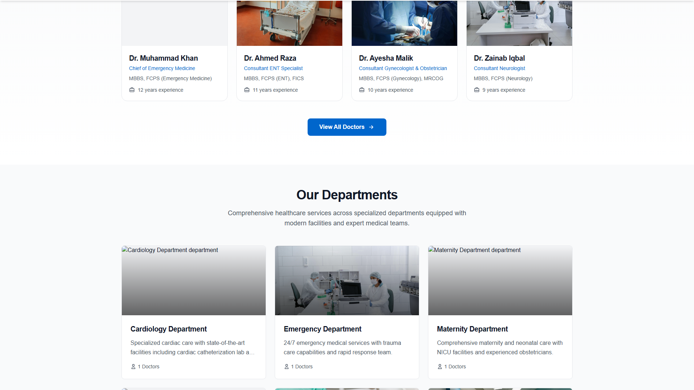

# 🏥 Hospital Website - Professional Healthcare Platform

[](https://nextjs.org/)
[](https://www.typescriptlang.org/)
[](https://tailwindcss.com/)
[](LICENSE)

A modern, responsive, and feature-rich hospital website platform built with Next.js 14, TypeScript, and Tailwind CSS. Designed to provide exceptional user experience for patients seeking healthcare services.



## ✨ Features

### 🎯 Core Features
- **🏠 Dynamic Homepage** - Hero carousel with 5 professional images, statistics section, testimonials, and certifications
- **👨‍⚕️ Doctor Management** - Comprehensive doctor profiles with search and filter functionality
- **🔍 Find a Doctor** - Advanced search with specialty filtering (ENT, Cardiology, Pediatrics, Orthopedics, Gynecology, General Surgery)
- **📅 Appointment Booking** - Easy-to-use booking system with doctor selection
- **🏢 Departments** - Interactive department pages showing specialists and services
- **💼 Service Pages** - Detailed pages for each medical specialty
- **📱 Responsive Design** - Mobile-first approach, works seamlessly on all devices

### 🎨 UI/UX Excellence
- Sticky navigation with dropdown menus
- Smooth carousel transitions with overlays
- Hover effects and micro-interactions
- Professional medical photography
- Consistent design system with blue/orange theme
- Social media integration in footer

### 🚀 Technical Highlights
- **Next.js 14 App Router** - Latest React framework with server components
- **TypeScript** - Type-safe development
- **Tailwind CSS** - Utility-first styling
- **Optimized Images** - Next.js Image component for performance
- **Static Generation** - Fast page loads with SSG
- **SEO Ready** - Metadata API for optimal search engine visibility

## 📸 Screenshots

### Homepage




### Doctor Sections



### Key Sections




## 🛠️ Tech Stack

| Technology | Purpose |
|------------|---------|
| **Next.js 14** | React framework with App Router |
| **TypeScript** | Type safety and better DX |
| **Tailwind CSS** | Utility-first CSS framework |
| **Framer Motion** | Smooth animations |
| **React Hooks** | State management |
| **next/image** | Optimized image delivery |

## 📦 Project Structure

```
hospital_website/
├── src/
│   ├── app/                    # Next.js App Router pages
│   │   ├── page.tsx           # Homepage
│   │   ├── find-doctor/       # Doctor search page
│   │   ├── doctors/           # Doctor listing & profiles
│   │   ├── departments/       # Department pages
│   │   ├── services/          # Service pages
│   │   ├── appointments/      # Booking system
│   │   ├── about/             # About page
│   │   ├── contact/           # Contact page
│   │   └── facilities/        # Facilities page
│   ├── components/            # React components
│   │   ├── layout/           # Header, Footer, Navigation
│   │   ├── hero/             # Hero carousel
│   │   ├── sections/         # Page sections
│   │   ├── doctors/          # Doctor components
│   │   └── common/           # Reusable components
│   ├── lib/                  # Utilities and helpers
│   └── types/                # TypeScript type definitions
├── public/
│   └── images/               # Static images
│       ├── doctors/          # Doctor photos
│       ├── hero/             # Hero carousel images
│       └── departments/      # Department images
├── config/                   # Hospital configuration
├── specs/                    # Project specifications
└── tests/                    # Test files

```

## 🚀 Getting Started

### Prerequisites

- Node.js 18+ and npm/yarn
- Git

### Installation

1. **Clone the repository**
   ```bash
   git clone https://github.com/tanveer-ahmed986/hospital_website.git
   cd hospital_website
   ```

2. **Install dependencies**
   ```bash
   npm install
   # or
   yarn install
   ```

3. **Set up environment variables**
   ```bash
   cp .env.example .env
   ```

   Edit `.env` and configure:
   - Database connection (PostgreSQL)
   - SMS service (Twilio)
   - Email service (SendGrid)
   - Google Maps API key
   - reCAPTCHA keys

4. **Run the development server**
   ```bash
   npm run dev
   # or
   yarn dev
   ```

5. **Open your browser**

   Navigate to [http://localhost:3000](http://localhost:3000)

### Quick Setup (Windows)

For Windows users, a quick setup guide is available:

```bash
# See SETUP_WINDOWS.md for detailed instructions
npm run setup:windows
```

## 📱 Pages & Routes

| Route | Description |
|-------|-------------|
| `/` | Homepage with hero carousel, statistics, testimonials |
| `/find-doctor` | Search and filter doctors by specialty |
| `/doctors` | Complete doctor listing with photos |
| `/doctors/[id]` | Individual doctor profile pages |
| `/departments` | All departments with specialists |
| `/services` | Healthcare services listing |
| `/services/[specialty]` | Individual service pages (ENT, Cardiology, etc.) |
| `/appointments` | Appointment booking form |
| `/about` | About the hospital |
| `/facilities` | Hospital facilities and equipment |
| `/contact` | Contact form and location |

## 👨‍⚕️ Featured Doctors

The platform currently features 6 specialist doctors:

- **Dr. Sarah Johnson** - ENT Specialist (15 years experience)
- **Dr. Michael Chen** - Cardiologist (20 years experience)
- **Dr. Emily Rodriguez** - Pediatrician (12 years experience)
- **Dr. James Wilson** - Orthopedic Surgeon (18 years experience)
- **Dr. Priya Sharma** - Gynecologist (14 years experience)
- **Dr. Robert Martinez** - General Surgeon (22 years experience)

## 🎨 Design System

### Colors
- **Primary Blue**: #2563EB (Trust, professionalism)
- **Orange Accent**: #EA580C (Call-to-action)
- **Neutral Grays**: For text and backgrounds

### Typography
- **Headings**: Bold, uppercase navigation items
- **Body**: Clean, readable sans-serif
- **Sizes**: Responsive scaling from mobile to desktop

### Components
- Cards with shadow and hover effects
- Rounded corners (xl: 12px)
- Smooth transitions (300ms)
- Gradient backgrounds for hero sections

## 🔧 Configuration

### Multi-Hospital Support

The platform supports multiple hospital deployments through YAML configuration:

```yaml
# config/hospitals/abc-general.yaml
hospital:
  name: "ABC General Hospital"
  logo: "/images/hospital_logo.png"
  primaryColor: "#2563EB"
  secondaryColor: "#EA580C"

contact:
  phone: "+92-300-1234567"
  email: "info@abchospital.com"
  address: "123 Main Street, City"
```

## 📊 Current Status

### ✅ Completed Features
- [x] Responsive homepage with hero carousel
- [x] Doctor profiles with search/filter
- [x] Department pages with specialists
- [x] Service pages for all specialties
- [x] Appointment booking form
- [x] Contact and about pages
- [x] Navigation with dropdowns
- [x] Mobile-responsive design
- [x] Doctor images integration
- [x] Social media links

### 🔄 In Progress
- [ ] Backend API integration
- [ ] Database setup (PostgreSQL)
- [ ] SMS/Email notifications
- [ ] Time slot selection
- [ ] Admin panel for content management

### 📋 Planned Features
- [ ] Patient portal
- [ ] Online payments
- [ ] Google Maps integration
- [ ] Blog/News section
- [ ] Multi-language support
- [ ] SEO optimization
- [ ] Analytics integration

## 🤝 Contributing

Contributions are welcome! Please feel free to submit a Pull Request.

1. Fork the project
2. Create your feature branch (`git checkout -b feature/AmazingFeature`)
3. Commit your changes (`git commit -m 'Add some AmazingFeature'`)
4. Push to the branch (`git push origin feature/AmazingFeature`)
5. Open a Pull Request

## 📄 Documentation

- [Specification Document](specs/001-hospital-website/spec.md) - Complete feature specifications
- [Database Schema](DATABASE_SCHEMA.md) - Database structure
- [Setup Guide](QUICK_SETUP_GUIDE.md) - Quick setup instructions
- [Windows Setup](SETUP_WINDOWS.md) - Windows-specific setup

## 🐛 Known Issues

- Time slot selection not yet implemented
- Form submissions are client-side only (no backend)
- No email/SMS confirmations yet
- Google Maps integration pending

## 📞 Support

For support, email tanveer.ahmed986@example.com or open an issue in the GitHub repository.

## 👏 Acknowledgments

- Built with [Next.js](https://nextjs.org/)
- Styled with [Tailwind CSS](https://tailwindcss.com/)
- Doctor images from [Pexels](https://www.pexels.com/)
- Icons from [Heroicons](https://heroicons.com/)

## 📝 License

This project is licensed under the MIT License - see the [LICENSE](LICENSE) file for details.

## 🌟 Star History

If you find this project useful, please consider giving it a star ⭐

---

<div align="center">
  <strong>Built with ❤️ using Next.js and TypeScript</strong>
  <br>
  <sub>Developed by <a href="https://github.com/tanveer-ahmed986">Tanveer Ahmed</a></sub>
</div>
